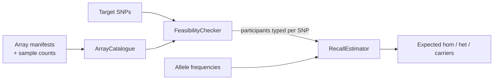

# SNP Feasibility Checker

[](https://github.com/dsugurtuna/snp-feasibility-checker/actions/workflows/ci.yml)

Check which genotyping arrays carry a set of target SNPs, how many participants that covers, and how many carriers and homozygotes to expect under Hardy-Weinberg equilibrium.

> **Portfolio project.** Demonstrates generalised SNP feasibility workflows. No real array manifests or participant data are included.

**Where this fits:** part of my clinical genomics and biobank data work. This repo works from array
manifests; [biobank-variant-explorer](https://github.com/dsugurtuna/biobank-variant-explorer) checks
the actual PLINK files; [ld-linkage-mapper](https://github.com/dsugurtuna/ld-linkage-mapper) finds
proxies for SNPs that no array carries; and
[recall-study-generator](https://github.com/dsugurtuna/recall-study-generator) designs the recall.

## The problem

Before promising a recall-by-genotype study, you need two answers quickly: is the SNP genotyped for
enough participants, and roughly how many people in each genotype group should exist? In a cohort
genotyped on several arrays over the years, "is it on the array" depends on which array, and the
number of people typed is not the cohort size.

## What this does

- **Array catalogue** (`ArrayCatalogue`): register arrays by hand or load a manifest CSV, naming the
  SNP column. A wrong column name raises an error instead of loading an empty array. Each array can
  carry the number of participants genotyped on it.
- **Feasibility check** (`FeasibilityChecker`): for each SNP, the arrays that carry it, the arrays
  that do not, and the number of participants typed for it.
- **Expected counts** (`RecallEstimator`): expected homozygotes (Nq²), heterozygotes (N·2pq) and
  carriers of at least one copy (N(1−p²)) for a given allele frequency, rounded to whole people.

## Quickstart

```bash
git clone https://github.com/dsugurtuna/snp-feasibility-checker.git
cd snp-feasibility-checker
python -m venv .venv && source .venv/bin/activate
pip install -e ".[dev]"
pytest
python examples/demo.py
```

The demo uses synthetic manifests, sample counts and allele frequencies. Its output, which
`tests/test_demo.py` checks:

```text
SNPs on at least one array: 3 of 4

snp        arrays            typed   hom   het carriers
rs9100001  ARRAY_A,ARRAY_B   10000   225  2550     2775
rs9100002  ARRAY_A            8000     3   314      317
rs9100004  ARRAY_B            2000   180   840     1020
rs9100009  -                     0     0     0        0

Expected counts under HWE, before consent, eligibility and response.
```

`rs9100004` has the highest allele frequency but is only on the smaller array, so its expected
homozygote count is lower than it would be across the whole cohort.

## How it works



## Design decisions

- **Use participants typed, not cohort size, as N.** A SNP on one array of three is typed only for
  that array's participants. Feeding the whole cohort into the estimate overstates the yield.
- **Round, do not truncate.** `int()` on a floating-point product dropped whole participants (for
  q = 0.02 and N = 10,000 it gave 395 carriers instead of 396). Expected counts are rounded.
- **Fail on a wrong manifest column.** Manifests from different vendors name the rsID column
  differently. Silently loading zero SNPs makes every target look unavailable, which is the worst
  kind of wrong answer: plausible.
- **Plain data classes, no dependencies.** The logic is simple set arithmetic and a formula; it
  should be easy to read and check by hand.

## Limitations and what this is not

- HWE expectations assume random mating and no selection. Real counts differ, especially for rare
  variants, variants under selection, or ancestry-structured cohorts. Use observed genotype counts
  when you have them.
- The allele frequency you supply should come from a population that matches the cohort.
- Expected counts are an upper bound on recall. Consent, eligibility, contactability and response
  all reduce the number you can actually recall; none of these are modelled.
- Matching is by exact SNP identifier. Vendor probe IDs must be mapped to rsIDs first, and genotype
  call rate or QC failure per SNP is not considered.
- `genotyped_samples` assumes each participant is typed on one array. If some are typed on several,
  it over-counts them.

## Roadmap

- Accept observed genotype counts from PLINK `--freq`/`--hardy` output instead of HWE expectations.
- Add per-SNP call-rate thresholds from array QC.
- Optional attrition factors (consent, response) shown separately from the genetic expectation.

## Development

```bash
make dev     # install with dev dependencies
make check   # ruff lint and format check, mypy, pytest
```

See [docs/WHY.md](docs/WHY.md) for the reasoning behind the design, and
[CONTRIBUTING.md](CONTRIBUTING.md) to contribute.

## Licence

MIT is declared in `pyproject.toml`, but no licence file is included yet.

---

Personal project by [Ugur Tuna](https://github.com/dsugurtuna). Not affiliated with or endorsed by any employer.
